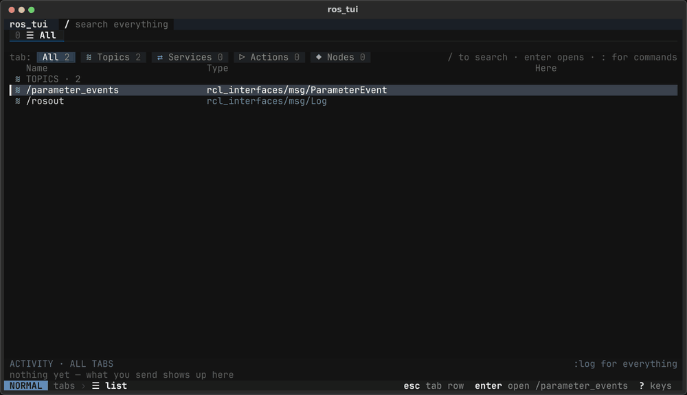

# ros_tui

ros_tui is a terminal UI for poking at a running ROS 2 system. Browse its
**topics, services, actions and nodes**, fill in a message field by field,
and echo, publish, call, send goals or set parameters, without typing
`ros2 ... "{...}"` one-liners. It is driven entirely from the keyboard, with
vim keys and familiar alternatives.



## Install

ros_tui is a ROS 2 (ament_python) package. It isn't released to the ROS
buildfarm yet, so build it from source in a colcon workspace:

```bash
mkdir -p ~/ros_tui_ws/src && cd ~/ros_tui_ws/src
git clone https://github.com/johanubbink/ros-tui.git
cd ~/ros_tui_ws
rosdep install --from-paths src --ignore-src -y
pip install --user --upgrade --break-system-packages textual rich
colcon build --packages-select ros_tui
source install/setup.bash
```

The `pip` line (from `python3-pip`) is needed because the `textual` in Ubuntu's
apt is far too old. ros_tui is developed and tested on ROS 2 Jazzy (Ubuntu
24.04).

## Run it

```bash
ros2 run ros_tui ros_tui
```

The ☰ list fills in from the live ROS graph and stays up to date. If a noisy RMW
prints warnings over the UI, send them elsewhere:
`ros2 run ros_tui ros_tui 2>>/tmp/ros_tui.stderr`.

## Using it

ros_tui opens on the **☰ list** of everything in the graph. `j` `k` (or ↑ ↓)
pick an entry, `enter` opens it in a tab, `/` finds anything by name, `?`
shows every key that works right now.

**Layers.** The screen is a stack: the tab row › inside a tab › inside an
area (a panel such as REQUEST) › typing a value. **`esc` always goes up one
layer, `enter` always goes down one**, and the footer always says where you
are and what those two will do. Keys never depend on focus.

**Only space sends.** Space (or `^s`) is an entry's one sending key; `r` starts
a repeating publish, and `s` only stops a repeat or cancels a goal. Moving and
editing never send, and a value is checked (and the field named) before
anything goes out.

- **Topics** open in Echo when someone publishes them, else in Publish (`e`
  switches). Echo shows the newest message with the count and Hz; `enter`
  freezes it to read it. Publish sends once, or `r` repeats at a rate.
- **Services**: edit the request, space calls it, the response and its time
  appear next to it.
- **Actions**: edit the goal, space sends it, feedback streams in until the
  result; `s` cancels. Goals still running are canceled when you quit.
- **Nodes**: a node's interfaces (`enter` opens one) and its parameters, which
  you change and then set with space.

Messages are edited as field rows, prefilled with the defaults. `f` on a
Header, Time, Quaternion or enum field opens a helper to fill it in, `y` / `p`
copy and paste a message between entries of the same type, `u` undoes, `[`
`]` bring back what you sent before.

| Key           | Does                                                      |
| ------------- | --------------------------------------------------------- |
| `enter` `esc` | down / up one layer                                       |
| `j` `k` `h` `l` | move (or the arrows, tab)                               |
| `space` `^s`  | publish, start / stop the echo, call, send the goal, set parameters |
| `r` `R` `s`   | repeat a publish, change its rate, stop it / cancel a goal |
| `e`           | switch a topic between Echo and Publish                   |
| `i` `c`       | edit the value / clear it and edit                        |
| `f`           | field helper                                              |
| `y` `p` `u`   | copy, paste, undo                                         |
| `0`…`9` `x`   | go to a tab, close it                                     |
| `/` `:` `?`   | search, commands (`:log`, `:rate 5`, …), all keys         |
| `:q`          | quit (or `ctrl+q`)                                        |

More detail, and every key, is in [docs/usage.md](docs/usage.md). Why the UI
works this way is in [docs/design-principles.md](docs/design-principles.md).

## Try it without a robot

The repo includes a Docker playground with some example servers. You only need
Docker with the Compose plugin; ROS isn't needed on the host.

```bash
docker/create_dot_env            # once: matches the container user to yours
docker compose up --build        # builds, then starts the demo servers
docker compose exec ros_tui bash # in a second terminal...
ros2 run ros_tui ros_tui         # ...then run the TUI inside it
```

You can also run turtlesim with it (needs X11). See
[docs/docker.md](docs/docker.md) for that and for what to try on each entry.

## Docs

- [docs/usage.md](docs/usage.md): the layers, each kind of entry, the
  editor, the field helpers and every key.
- [docs/docker.md](docs/docker.md): the Docker playground, the demo servers
  and turtlesim.
- [docs/design-principles.md](docs/design-principles.md): the rules behind
  the UI, its look and its copy, for anyone changing it.
- [docs/architecture.md](docs/architecture.md): how ros_tui works inside.
- [docs/testing.md](docs/testing.md): running the tests, and
  `scripts/make_gif.py`, which remakes the GIF above.

## License

ros_tui is released under the Apache License 2.0. See [LICENSE](LICENSE).
