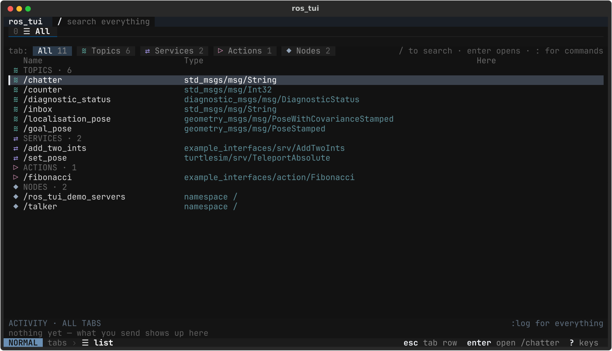
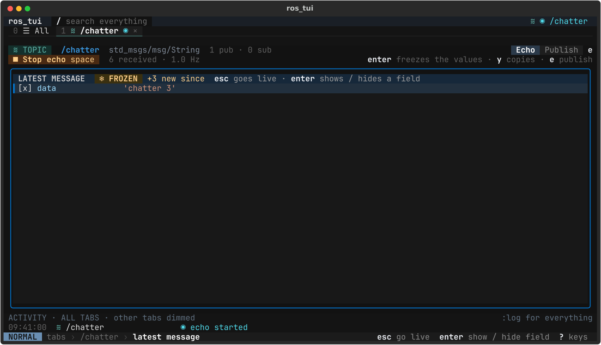
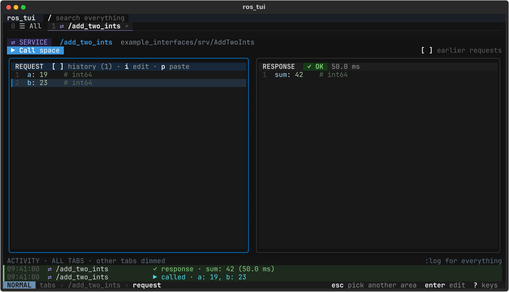
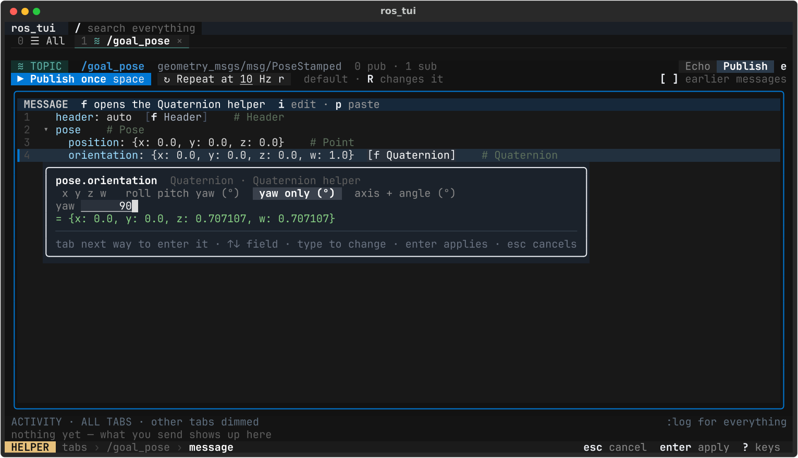

# Design principles and style guide

This is the guide for anyone changing the ros_tui UI. It covers why the UI is
the way it is, the rules that keep it predictable, and how it looks and talks.
The UI follows the "Hybrid Keys" prototype,
[`docs/design/hybrid-keys.html`](design/hybrid-keys.html); open it in a browser
and use the keyboard. Where the two differ, this page says so and why.

Keep it current: a change that adds a rule, a pattern or a look adds it here
too. [usage.md](usage.md) is the user's side of the same keys, and
[architecture.md](architecture.md) the map of the code.

## Why

The UI is for someone poking at a live robot from a terminal, often over SSH,
often in a split pane. Three goals follow from that, and every rule below
serves one of them.

1. **Width is precious.**
   - There is no sidebar or permanent list pane; the default terminal is 124×34.
   - The list of everything is a tab of its own (☰, tab 0), and an opened entry
     gets the full width.
   - Help, search and commands are overlays that appear when asked for and then
     go away.
2. **Behaviour is predictable on every layer.**
   - The UI is a strict stack of layers. **esc always goes up one layer and
     enter always goes down one.**
   - What a key does depends only on the layer and the entry, never on where
     keyboard focus happens to be.
   - The footer always says which layer you're on and what esc and enter will
     do.
3. **Nothing reaches the robot by accident.**
   - What's in the editor goes out on space or `^s`, and on nothing else. The
     only other key that sends is `r`, which starts a repeating publish; `s`
     only ever stops or cancels. See keymap rule 3.
   - Navigation and editing keys (enter, esc, tab, the arrows, hjkl, typing)
     never send anything. A send flashes when it goes out and lands in the
     activity strip.
   - Values are validated before anything is sent. An invalid value is never
     sent, and the error names the field.

## The layer model

| # | Layer | What it is | Move | esc | enter |
|---|-------|-----------|------|-----|-------|
| 1 | **Tab row** (`tabs`) | the row of open tabs (☰ list, 1…9) | `h` `l`, ← →, tab / shift+tab | nothing ("top layer — :q quits") | go into the tab under the cursor |
| 2 | **Inside a tab** (`in`) | on ☰: the mixed list; on an entry: its areas (panels) | ☰: `j` `k`, ↑ ↓, tab cycles the kind chips. Entry: `h` `j` `k` `l`, arrows, tab pick an area | up to the tab row | ☰: open the entry under the cursor. Entry: into the picked area |
| 3 | **Inside an area** (`area`) | the rows of one panel: message fields, parameters, interfaces, echoed fields | `j` `k`, ↑ ↓, tab; `gg` `G`; on field rows `h` `l`, ← → fold and unfold | up to the area pick ("back out", or "go live" on a frozen echo), however deep the row | do the row's thing: edit a field or parameter, unfold or fold a nested message or list, open an interface in a tab, show or hide an echoed field |
| 4 | **Insert** (`edit`) | typing into one value | typing; tab keeps it and edits the next field | keep it (if it's invalid: drop it and keep the old value, with a toast) | keep it (if it's invalid: stay, with an errline) |

`i` and `a` edit the field under the cursor, `c` clears it and edits. From the
area pick they go straight to Insert.

**Overlays** sit on top of the layers and don't change them. Closing an overlay
returns to exactly the layer and cursor you were on.

| Overlay | Opens with | Mode badge | Closes with |
|---------|-----------|------------|-------------|
| Search | `/` or `^f` | SEARCH | esc (stay where you were), enter (open the match in a tab) |
| Command line | `:` | COMMAND | esc or backspace on empty (cancel), enter (run) |
| Which-key | `?` (all keys); the `g` prefix shows its own small popup | (unchanged) | any key |
| Field helper | `f` on a field with a helper | HELPER | esc (cancel, nothing changes), enter (apply; `u` undoes) |
| Activity log | `:log` | (unchanged) | esc (close), enter (go to that entry's tab) |

When several are open, keys go to the topmost first: which-key, then the
helper, the command line, the log, search, insert, and finally normal mode.

**Global keys in normal mode** work on layers 1–3: `0`–`9`, `H` `L` (also `gT`
`gt`), `x`, `u`, `y`, `p`, `/`, `:`, `?`, `g…`.

**Entry verbs** work on layers 2–3 of an entry: space, `^s`, `s`, `r`, `R`, `e`,
`f`, `[` `]`.

## Keymap rules

Follow these when adding or changing a key.

1. **Pick its layer or context first.**
   - A key belongs to a layer (tabs, in, area, edit), an overlay, or an entry
     kind (and mode, e.g. topic Publish).
   - It does nothing anywhere else. A key with no meaning in a context logs
     `nothing on "z" here — ? shows the keys`; it never falls through to a
     different action.
2. **Pair a vim key with a familiar one** where that makes sense:
   - `j` `k` with ↑ ↓, and `h` `l` with ← →
   - `/` with `^f`, `H` `L` with `gT` `gt`, and space with `^s`
   - enter, esc and tab always work, so nobody has to know vim.
3. **Space and `^s` send; `r` repeats; nothing else sends.** This follows
   the prototype's "Keys right now" list (`keyList()` in the design), minus
   its `.` (resend the last send), which was dropped.
   - Space, with `^s` as its alias, is the entry's primary verb: publish once,
     call, send the goal, set the changed parameters, or start / stop an echo.
     In Insert, `^s` keeps the value and sends; a value that doesn't validate
     is never sent.
   - `r` (topic Publish only) starts repeating the publish at the shown rate,
     with `↻`, until `s` stops it. `r` on a running repeat only says so
     (`already repeating at 10 Hz — s stops it`); in Echo it sends nothing and
     says `e` switches to Publish. `R` (or `:rate 5`) changes the rate.
   - `s` only ever stops: it stops a repeat or cancels a goal. In Echo it
     explains that space stops the echo.
   - No other key sends, and no navigation or editing key ever does. A send
     always flashes its button and adds an activity line.
   - In `keymap.py`, `primary` is dispatched by space and `^s` only, and the
     "Do (only these send)" group holds nothing but space (`test_keymap.py`
     checks both).
4. **Every key is in `keymap.py` with a label.**
   - `KEYMAP` is a tuple of `Binding(mode, group, show, label, alias, when,
     shown, run)`. `mode` is the input mode (normal, `g`, insert, search,
     command, activity, helper, which-key), `when` lists context predicates
     (`PREDICATES`, `!` negates), `run` maps keys to `NavState` actions.
   - Dispatch takes the first row that matches; two rows that both match must
     agree. Rows with an empty `show` only dispatch, rows without `run` are only
     listed.
   - The footer, the `?` which-key (`keys_now`) and the `g…` popup
     (`which_key_items`) are generated from it, and the key tables in
     [usage.md](usage.md) must match it (`test_keymap.py` checks).
   - A key that isn't in the table doesn't exist. Its label is the short phrase
     the prototype uses, e.g. "pick an area", "into the latest message: values
     freeze".
5. **Reserved keys.** These mean the same thing everywhere they apply. Don't
   reuse them for something else:
   - Layers: `esc` `enter`
   - Sending: `space` `^s` `r` `s` (`.` is free: nothing resends)
   - Moving: `h` `j` `k` `l` and the arrows, `tab` `shift+tab`, `gg` `G`
   - Tabs: `0`–`9` `H` `L` `gt` `gT` `x`
   - Editing: `u` `y` `p` `i` `a` `c` `f` `e` `R` `[` `]`, and on field rows
     `o` `d` (add / delete a list element)
   - Overlays: `/` `^f` `:` `?` `g`
   - Quitting: `:q`
6. **Undo is per entry.** `u` undoes your last change in this entry (edits,
   pastes, rate changes, parameter changes and applied helpers), or reopens the
   tab you just closed: a closed tab has no tab of its own to undo from, so any
   tab can reopen it. Each entry keeps its own stack, so switching tabs never
   undoes something elsewhere. With nothing to undo here, `u` says exactly
   `nothing to undo here` (log and toast), and nothing else.

## The field-row editor

Every message the user fills in (a service request, a topic's message and an
action's goal) is edited as **field rows**, one row per field, that
expand in place. There is no YAML mode. The model is `ros_tui/ui/fields.py`
(`FieldRows`); `widgets/field_rows.py` draws it; `entries/message.py`
(`MessageEntry`) holds it per entry and does the keys.

**Row shapes.**

| Shape | Looks like | enter | Typed as |
|-------|-----------|-------|----------|
| leaf (number, bool, string) | `1  a: 19    # int64` | edit it | the value; a string field takes bare text as the string (`hello world`), quotes only when you want them read as YAML (`'42'`) |
| compact message | `3  header: auto    # Header` | edit it | one flow map, `{x: 1.0, y: 2.0, z: 0.0}`; keys you leave out keep their old value; `header: auto` and `stamp: now` stamp at send time |
| other nested message | `▸ pose {…}` / `▾ pose` | unfold / fold | (its fields, one level in) |
| list or fixed array | `▸ points [3 items]` | unfold / fold | its elements `[0]`, `[1]` … one level in; a list of numbers or strings can also be typed whole on its own row (`i`), `[1, 2.5]` |

- **Compact types** are a short, fixed list: `COMPACT_TYPES` in `fields.py`
  (Point, Point32, Vector3, Quaternion, Pose2D, Header, Time, Duration). Keep
  it small: a compact row is only worth it when the whole value fits on one
  line and is usually typed in one go.
- A message whose only field is a nested message starts unfolded (a service
  request of one message would otherwise be a single folded row).
- A nested message whose fields are all compact rows starts unfolded too, at
  any depth outside a list (`fields._compact_parents`): a Pose (position,
  orientation), a Twist, a Transform. So /goal_pose reads `header`, `▾ pose`,
  `position`, `orientation`, and orientation is `j j j` away, as in the design
  (which shows `pose.position` flat). A message with any other field stays
  folded.
- **Folding keys.** esc still means "up one layer" on every row, so folding
  has its own keys, as a file tree does: enter on a folded row unfolds it and
  on an unfolded row folds it; `h` / ← folds an unfolded row and on any other
  row jumps up to its parent row; `l` / → unfolds a folded row and on an
  unfolded one steps into its first field. Folds are remembered per entry.
  The footer's enter label says `unfold` or `fold` on such a row.
- **List keys.** `o` adds an element after the one under the cursor (on the
  list's own row: at the end) and starts editing it, as vim's `o` opens a line;
  `d` deletes the element under the cursor (or the one the cursor is inside).
  Each is one undo step. A fixed array can't grow or shrink ("k always has 9
  elements"), a bounded list stops at its bound ("holds at most 3 elements").
  `x` is not used: it closes the tab everywhere.
- enter always does what the footer's enter label says: on a list of numbers it
  unfolds or folds, and `i` / `c` type the whole list.
- tab and shift+tab in insert keep the value and edit the next / previous row
  that can be typed, skipping nested messages and lists of messages (a list of
  numbers is typed whole).
- A number that is still `0`, like a bool, starts **fresh**: the first key
  replaces it (shown on `edit-fresh`). Whole numbers are read as decimal, so
  `019` is 19.
- **Validation copy.** A typed value is parsed by its row first: `a needs a
  whole number, got "abc"`, `x needs a number, got "5x"`, `flag needs true or
  false, got "1"`, `pose.position needs {x: …, y: …, z: …}, got "1, 2"`. Then
  the whole message is checked by `build_message`; its `FieldError` is shown
  only when its path is the edited row or inside it, as `<path> must be …`
  (`status[0].level must be an integer in [0, 255], got 300`). As everywhere,
  enter on a bad value stays in insert with an errline; esc drops it with a
  toast.
- **Before a send** the message is built once more. If that fails (a value set
  some other way), nothing is sent: the folds open to show the field
  (`FieldRows.reveal` maps the `FieldError.path` to the deepest row that is
  shown), the cursor goes to it, its value turns red, the errline names it and
  the toast says `fix the highlighted values first`.
- **History.** Every send goes to the front of the entry's history
  (`SEND_HISTORY_MAX`). `[` shows the previous send in the editor and `]` the
  next one; `]` past the newest brings back what you were typing (the draft).
  `[` skips the newest send when the editor already shows it, and says `that
  was the oldest send` at the end. The REQUEST title shows `[ ] history (n)`,
  or `[ ] history #i/n` while an older send is shown.
- **Echoed messages** use the same structure, flattened (`fields.flat_rows`):
  nested messages that aren't compact open down to their fields, so each
  LATEST MESSAGE row is one value, one compact message or one list, named by
  its path (`pose.pose.position: {x: 1.0, y: 2.0, z: 0.0}`).
- **Echoed floats are cut for display only**: to `ECHO_DISPLAY_DIGITS` (6)
  significant digits, never cutting the whole part (`fields.readable`, used by
  `flat_text`): `1.0806046117362795` shows as `1.0806`. The values the entry
  keeps are exact, so what is copied from an echo is exact too.
- The type is imported in a worker thread (`MessageEntry.load_types`, through
  `BridgeEntry._work`) the first time the entry opens; until then the editor
  says `loading…`, or `✗ could not load it: …`.

## The register (y / p)

`y` copies a message and `p` pastes it, through one register for the whole app
(`NavState.register`, a `register.Register`, the design's `S.reg`). The model is
`ros_tui/ui/register.py` (pure); the entries do the copying and pasting
(`MessageEntry.yank` / `paste` in `entries/message.py`, `TopicEntry.yank_echo`).

- **What y copies.** In a topic's Echo: the message LATEST MESSAGE shows, so
  the frozen one while frozen (`copied the frozen String from /chatter`), else
  the newest (`copied the latest String from /chatter`). The entry keeps the
  newest and the frozen message as they arrived as well as converted for
  display (`TopicData.latest` / `shown`, each a `Received`), so the copy is exact: floats keep every digit and long arrays
  and strings aren't cut, unlike what the echo shows. In an editor (a topic's
  Publish, a service's REQUEST, an action's GOAL): what the editor holds
  (`copied the message` / `request` / `goal`). On a node: nothing (`nothing to
  copy on a node`). An echo that isn't running or has nothing yet says so:
  `start the echo first (space)`, `no messages to copy: nobody publishes
  /inbox`.
- **It is typed.** The register holds the full type and the role: `message`
  (a topic), `request` (a service) or `goal` (an action). `p` pastes only into
  an editor of the same type in the same role; anything else is refused with
  `copied a String, this needs a PoseStamped` (`Register.mismatch`, a role
  reads `AddTwoInts request`). Echo has no editor: `switch to Publish (e) to
  paste`. With nothing copied: `nothing copied yet (y copies)`.
- **A paste is one undo step** (`undid the paste from /chatter on /inbox`) and
  replaces the whole message; the toast says `pasted from /chatter · u
  undoes`. Pasting what the editor already holds is no undo step. A paste never
  sends: space does.
- The register is a copy: editing the editor it came from later doesn't change
  it. While it holds something, the top bar shows the chip `copied: String from
  /chatter · p pastes` in `reg` after the search hint.

## Field helpers

`f` on a field row with a helper opens a small popup right under the row that
fills the value for you (the design's `.hpop`). The model is
`ros_tui/ui/helpers/` (pure, like `nav.py`); `widgets/helper_popup.py` draws it
(`HelperPopup`, an `Overlay` in the body, under the row or above it when it
doesn't fit; `entry_body.row_line` says where the row is drawn, scrolling
included); `entries/message.py` (`MessageEntry`) opens it and writes its
value, so every message editor has the helpers: a topic's MESSAGE, a service's
REQUEST and an action's GOAL.

| Kind | Rows | Modes (tab / shift+tab) | Writes |
|------|------|-------------------------|--------|
| Quaternion | `geometry_msgs/Quaternion` | `x y z w` (normalised), `roll pitch yaw (°)`, `yaw only (°)`, `axis + angle (°)` | `{x: 0.0, y: 0.0, z: 0.707107, w: 0.707107}`, rounded to 6 digits |
| Header | `std_msgs/Header` | `auto`, `now` (frame_id), `manual` (frame_id, stamp in seconds) | `auto`, `{stamp: now, frame_id: map}`, `{stamp: {sec: 2, nanosec: 500000000}, frame_id: map}` |
| Time | `builtin_interfaces/Time` | `now`, `seconds`, `sec + nanosec` | `now`, `{sec: 2, nanosec: 500000000}` |
| Enum | a whole number with enum constants (`FieldNode.constants`, e.g. DiagnosticStatus `level`) | none: a list of options, `● 1 WARN = 1` | the number |

- **The popup**, top to bottom: the field (bold) and `<type> · <Name> helper`
  (dim); the mode strip (the mode that is on in `bright` bold on `cursor-on`)
  or an enum's options (the picked one on a `cursor-on` band with the `▍`
  bar); for Header and Time a dim line saying what the mode does; the mode's
  fields (`nothing to fill in` when it has none), each a grey name and its
  value right-aligned in 8 cells, underlined, the one being typed on `hb-on`
  with the text cursor; the preview `= …` in `ok`, or `= fix the values first`
  in `bad`; a rule; the keys in `help-field`. It is as wide as its key line
  (at least `MIN_WIDTH`).
- **Keys** (keymap mode `helper`; the popup takes every key, nothing moves
  underneath): enum: `j` `k` `↑` `↓` (and tab / shift+tab) pick, a digit jumps
  to that option; the key line and `?` say `0–3` for the real count (the
  keymap's `{jump}`, `Helper.jump_keys()`; only 0–9 jump). Others: tab / shift+tab the next / previous mode (its
  fields start afresh), `↑` `↓` `←` `→` the field, typing changes it (the
  first key replaces the value, as `edit-fresh` does), backspace edits.
  enter applies, esc cancels. While it is open the badge is HELPER and the
  footer says `esc cancel  enter apply`. `f` from the area pick goes into the
  area first, as `i` does.
- **Applying** writes the value as typed text through the row
  (`FieldRows.accept(flow_yaml(value))`), so it is parsed and checked by
  `build_message` like an edit, and is one undo step (`undid the Quaternion
  helper on pose.orientation on /goal_pose`). The log says `filled
  pose.orientation = {…} (u undoes)`; the same value again is no undo step.
  While the fields make no value, enter keeps the popup open with the toast
  `fix the highlighted values first`. esc says `helper closed, nothing
  changed`.
- **Enums in insert.** Typing into an enum field takes a constant's name or
  the start of one, in any case, or a number (`fields.enum_value`): `err` is
  2, `w` is 1. While it is typed, the completion (`fields.enum_matches`, in
  `comp`) replaces the type hint: `OK=0  WARN=1  ERROR=2  STALE=3 · type a
  name or number`, narrowed as you type. Anything else is `level needs OK /
  WARN / ERROR / STALE or a number, got "hot"`. At rest the row shows the
  number and the name dim, `level: 2 ERROR`.
- `f` on a row without one says `no helper for this field — fields with one
  show [f …]` (a bad toast), and nothing opens.

## Visual language

### Colour tokens

These are from the design's `:root`. They live in one place,
`ros_tui/ui/theme.py`: `TOKENS` (these plus the greys and surfaces of the
design's terminal CSS), `KINDS` (the kind table below) and `MODES` (the footer
badges). Rich text in widgets names a token (`style('key', 'tab-cur')`); textual
CSS uses the same values as `$rt-<token>`, `$rt-kind-<kind>` and
`$rt-mode-<mode>` (`theme.css_variables()`, merged in by the app). Don't put hex
values in widget code or CSS; add a token instead.

| Token | Value | Use |
|-------|-------|-----|
| `term` / `term-2` / `term-3` | `#121212` / `#181818` / `#1e1e1e` | terminal background / panel body / panel title |
| `tline` | `#333333` | panel border at rest |
| `text` | `#dcdcdc` | body text |
| `muted` | `#7d8794` | secondary text: the type in an entry's header |
| `accent` | `#3a96dd` | entry names in headers |
| `accent-fill` | `#0178d4` | primary buttons, the inside-an-area panel border |
| `key` | `#eceff4` | key caps in hints, the selected-panel border, the tab-row cursor |
| `ok` | `#89d185` | success, "● live", ↻ repeating, INSERT badge |
| `live` | `#4fd8e8` | running: ◉ echoing, the action spinner, "calling…" |
| `warn` | `#ffd08a` | ❄ FROZEN, "+N new since", canceled, "● changed", stop buttons |
| `bad` | `#f48771` | errors: errlines, bad toasts, ✗ |
| `panel-hint` | `#9a9a9a` | the hints after a panel's title |
| `err-bg` | `#201414` | the errline under a panel |
| `edit` / `edit-fresh` | `#1c2733` / `#2f4f73` | a value being typed / one the first key replaces (a bool) |
| `btn` / `btn-text` | `#1f1f1f` / `#e6e6e6` | a button at rest (the design's `.btn`), e.g. `↻ Repeat at 10 Hz r` |
| `stop-bg` | `#4a2a12` | a stop button (`■ Stop echo`, `■ Stop repeating`, `■ Cancel goal`); its text is `warn` |
| `btn-off` / `btn-off-bg` | `#5a5a5a` / `#181818` | a disabled button's text and background (the design's `.btn[disabled]`) |
| `hb-edge` / `hb-text` / `hb-on` | `#4a5568` / `#aab4c3` / `#2a313b` | a row's `[f …]` helper badge (the design's `.hb`); `hb-on` is the badge on the cursor row and the helper field being typed |
| `help-field` | `#6a7382` | the helper popup's key line (the design's `.hf`) |
| `comp` | `#7f8a99` | an enum's completion while it is typed (the design's `.comp`) |
| `reg` | `#c586c0` | the register chip in the top bar (the design's `.reg`) |
| `fresh-bg` / `fresh-bad-bg` | `#1d2a1d` / `#2a1a1a` | a fresh activity line's band (the design's `.fl.new`, `.fl.new.bad`) |

Syntax colours in message rows (`widgets/field_rows.py`): field keys `syn-key`
`#9cdcfe`, numbers and bools `syn-num` `#b5cea8`, strings `syn-str` `#ce9178`,
type hints `syn-hint` `#5c6f5c`, row numbers `line-no` `#4a4a4a`. Compact rows
are in `text`; `▸ {…}` and `[3 items]` are `dim`; a value the send check
rejected is `bad`. Pill backgrounds: `live-bg` (calling…), `ok-bg` (✓ OK),
`warn-bg` (CANCELED), `bad-bg` (✗ FAILED).

### Entry kinds

Every entry carries its kind's glyph in its kind's tint: in the list, in tabs,
in search results, in activity lines and in the entry header (`≋ TOPIC`).

| Kind | Glyph | Colour | Tag background |
|------|-------|--------|----------------|
| topic | `≋` | `#5fb3a8` | `#14302c` |
| service | `⇄` | `#a597ea` | `#241f3d` |
| action | `▷` | `#d995b9` | `#3a1f2f` |
| node | `◆` | `#93a4b8` | `#222a33` |

The active tab is underlined in its kind's colour, and the ☰ tab in
`accent-fill`.

### Panels: selected vs. inside

An entry's body is made of panels (areas): MESSAGE, LATEST MESSAGE, REQUEST and
RESPONSE, GOAL and RESULT, INTERFACES and PARAMETERS. The title is in capitals,
in `label` bold, and the hints follow it after two spaces in `panel-hint`, with
keys in `key` bold and parts joined by " · " (`enter edits · space sets`,
`enter opens it in a tab`). A state can replace the hint, e.g. `● changed ·
space sets` in `warn`.

- **At rest**: a `tline` border.
- **Selected** (layer 2, the area under the cursor): a `key` (near-white)
  border, title on `tab-cur` (`#262b33`). No row is highlighted.
- **Inside** (layers 3 and 4): an `accent-fill` (blue) border, title on
  `panel-in` (`#16283a`). The current row gets a `row-in` (`#22303e`) band
  with a `▍` in `accent-fill` in its first cell (the design's 2px inset bar).
- The body scrolls to keep the current row in view. Group headings inside an
  area (`▾ Publishes`) are lines, not rows: the cursor skips them.
- An **errline** takes the panel's last body line: ` ✗ ` and the message in
  `bad` on `err-bg`. It goes away after `NAV_ERRLINE_S` (6 s, as the design's
  `inl`) or when the value is kept or dropped.
- A **changed** value that isn't sent yet shows as the new value in `warn`, then
  `was <old>` in `dim`.
- A **loading** area says `loading…` in `dim` until the bridge answers, or
  `✗ could not load it: <error>` in `bad`.

On the ☰ list the same logic applies to rows: the cursor row is `#2b3a4a`, with
a `key` outline while the list has the keys.

### Terminal approximations

The design is HTML; the terminal has whole cells and no borders between them.
These are the agreed stand-ins. Use them, rather than inventing new ones:

- **Tab underline**: the tab row is two lines. Under the tabs is a rule of `▔`
  in `rule`; the active tab's stretch of it is in its kind's tint (`accent-fill`
  for ☰). This stands in for the design's 2px `border-bottom`.
- **Tab-row cursor**: the cursor tab gets `▏` `▕` edges in `key`, `key` text and
  the `tab-cur` background, for the design's 1px outline.
- **List cursor**: the cursor row has the `cursor` background; while the list has
  the keys (layer `in`) it turns `cursor-on` and gets a `▍` bar in `key` in the
  first cell, for the design's `key` outline.
- **Chips and switches** (kind chips, the Echo / Publish switch): pills become
  ` label ` blocks on `term-3`, the one that is on in `bright` bold on `cursor`.
  There are no rounded borders.
- **Panels**: rounded box-drawing borders (`╭─╮│╰─╯`) in the panel's state colour
  (`tline`, `key` selected, `accent-fill` inside), a one-line title bar on the
  state's title background, then the body on `term-2`. Side-by-side panels share
  the width by the design's flex weights (`PANEL_WEIGHTS`), except GOAL and
  RESULT: 3:2 instead of the design's 2:1, so RESULT's title (`EXECUTING 12.3 s
  · live feedback`) stays whole at 124 columns.
- **Wrapped lines**: a panel with `wrap` (RESULT, the design's `.lwrap`) wraps a
  long line at a space, the rest indented by two cells, instead of cropping it.
  It counts terminal cells (`rich.cells.cell_len`), not characters.
  The current row's band covers all of its lines.
- **Overflow markers**: `‹ N more` and `N more ›` in `key` at the edge of the tab
  row that hides tabs. The row scrolls by whole tabs.
- The design's 1px rules above the activity strip and the footer are left out:
  a whole row each is too much at 34 lines. The strip and the footer keep their
  own backgrounds (`strip`, `foot`) instead. So is the command line's magenta
  top rule.
- **Overlays** (search, `:log`, which-key, the command suggestions, the field
  helper, the toast) are `Overlay` views (`widgets/base.py`) on the `overlay`
  layer, placed absolutely: each one's `place(width, height)` returns its box
  in its parent and `RosTuiApp.refresh_views` applies it, after each key and
  tick and also whenever the body changes size (`Body.on_resize`: the activity
  strip grew a line), so a toast never sits below the body. Popups get a
  rounded border in their edge colour. The border cells are on the popup's background, so the popup has
  a thin frame of its own colour outside the line; there's no shadow. Rules
  inside a popup are a row of `─` in `pop-line` (`rule()`). A popup's picked row
  is a band of `cursor-on` with the `▍` bar (`cursor_bar()`), like the list
  cursor; the picked command suggestion is a `cmd-sel` band. The `?` popup
  puts two keys on a line; a key whose label doesn't fit its column gets the
  whole line rather than being cut (`u undo in this tab (or reopen a closed
  tab)`).
- **Veil**: textual doesn't blend a translucent layer with what's under it, so
  the design's `rgba(0,0,0,.5)` veil under search and `:log` is `opacity: 50%`
  on everything but the footer (the screen's `-veiled` class).
- **Text cursor**: a typed value ends in a one-cell block in `text` on `term`.
- **Edit box**: the design outlines the value being typed in `key`; a terminal
  can't outline a few cells, so the value is underlined in `bright` on the
  `edit` background (`edit-fresh` when the first key replaces it), then the
  text cursor (`base.edit_value`). The background alone was invisible on the
  `row-in` band.

### Footer contract

The footer is one line, and it always shows, from left to right:

1. **Mode badge**:
   - NORMAL `#6a8fb3`
   - INSERT `ok` green
   - HELPER `#e6c07b`
   - SEARCH `#c9d1d9`
   - COMMAND `#c586c0`

   The badge is dark text (`#121212`) on the colour.
2. A pending prefix, e.g. `g…`.
3. **Breadcrumb**: `tabs › /chatter › latest message › editing`. The last part
   is bold white, the rest dim.
4. Pushed right: **`esc <what it does here>`** and **`enter <what it does
   here>`**, e.g. `esc go live`, `enter show / hide field`, `enter open
   /chatter`. Either one is left out when it does nothing.
5. `f <Helper> helper` when the row under the cursor has one, then `? keys`.

The command line replaces the footer while it's open: COMMAND, the typed
`:text`, then "↑↓ pick · tab completes · enter runs · esc cancels".

### State markers

- **Running**:
  - `◉` (`live`) is a topic being echoed and `↻` (`ok`) a topic repeating.
  - The `◐◓◑◒` spinner (`live`) is an action's goal executing. Its frame comes
    from the clock (`ACTION_SPINNER_HZ`, 4 frames a second, as the design's
    `S.t*4`), so every view shows the same frame; the Here column says
    `◐ running`.
  - Markers show after the name in the tab (`/chatter ◉`), in the top bar's
    running list (`≋ ◉ /chatter  ≋ ↻ /inbox`), in the list's Here column
    (`◉ echoing`, `↻ 10 Hz`, `◐ running`, then `open`) and in search rows
    (before `open tab`).
  - They show whether the entry's tab is open or not: an echo, a repeat or a
    goal keeps running when you switch or close its tab, as in the design,
    until space or `s` stops it (or the goal ends). A closed tab's echo, repeat
    or goal stays in the top bar and the Here column, so it is never invisible;
    reopen the entry (`u` right after `x`) to stop it.
    **Quitting stops everything**, so nothing keeps acting on the robot after
    you quit: `bridge.shutdown()` first cancels a running goal (as `ros2
    action send_goal` does on ctrl+c, waiting at most
    `SHUTDOWN_CANCEL_TIMEOUT_S` for the server), then destroys the node with
    its subscriptions and repeat timers.
  - One hook feeds all of them: an entry kind's `running()` returns its
    `nav.Running(glyph, label, tone)` markers by entry; `NavState.running(kind,
    name)` and `running_all()` read them, and `widgets.base.markers` draws them.
    A new running thing only adds a marker there, as the goal spinner did.
- **Echo live vs. frozen**:
  - The LATEST MESSAGE title says `● live · enter freezes it`, or `not echoing ·
    space starts`. Not echoing, every value is `–`.
  - Going inside freezes the values: a `❄ FROZEN` pill, then `+N new since`
    (`warn`, counting what arrived since), then `esc goes live · enter shows /
    hides a field`. The footer's esc says `go live`.
  - **Frozen is where the cursor is, not a flag**: an echo is frozen exactly
    while the cursor is inside its LATEST MESSAGE (`TopicEntry.frozen`).
    Leaving the area by any key (esc, a tab switch, `e`) makes it live again;
    nothing can stay frozen by accident.
  - With nobody publishing, a value says `waiting — nobody publishes this
    yet`; with a publisher but no message yet, `waiting for the first message…`.
  - enter on a field hides it (`[ ] data  hidden`) or shows it (`[x]`), per entry.
  - The echo's row is the button and what it counted: `■ Stop echo space
    3 received · 1.0 Hz`, then `· N dropped` in `warn` when the buffer dropped
    some.
- **Goals** (the action entry, `entries/action.py`):
  - **One goal runs at a time, app-wide** (the design's `S.goal`). While any
    goal is sending or executing, space on any action tab sends nothing: the
    errline and a red activity line say `a goal is already running on
    /fibonacci`, plus ` — s cancels it` on that goal's own tab. The Send button
    looks disabled meanwhile, and on another action's tab `a goal is running on
    /fibonacci` follows it. `ActionEntry` holds every action tab, so it knows
    the one that runs (`executing()`).
  - `■ Cancel goal s` has the stop look while this entry's goal runs and is
    disabled otherwise. `s` asks the server to cancel (`cancel_goal`); the goal
    ends when the server sends the CANCELED result. An `s` while the goal is
    still on its way is kept and sent once the server accepts it. `s` on another action's tab
    says `nothing running here — the goal runs on /fibonacci`.
  - RESULT's title: no goal yet, then a pill (below) and the time on the
    bridge's clock: `EXECUTING 2.4 s · live feedback` (`· canceling…` after
    `s`), `SUCCEEDED 3.6 s`, `CANCELED 2.4 s · last feedback`, `ABORTED 1.8 s`,
    `REJECTED`, `FAILED`. The body is the newest feedback while it runs (`waiting
    for feedback…` before the first), the last feedback after a cancel, else the
    result, as flat rows like an echo (floats cut for display); a rejection or
    an error is its errline.
  - Feedback is live data: the bridge pushes it into the goal's bounded
    `EchoBuffer` on its thread, and the tick drains it, converting only the
    newest. The other events (accepted, result, rejected, error) are posted to
    the UI thread. Elapsed time stops at the end event's clock time. Each goal's
    events are bound to that goal, and once it ended a late event changes
    nothing, so a stale event can't touch the next goal.
- **Repeat rate**: the rate shows in the Repeat button, underlined, with a note
  after it: `matches the publisher` (the rate the echo measured), `your rate`
  (set with `R` or `:rate`) or `default` (`PUBLISH_DEFAULT_RATE_HZ`), then
  `R changes it`. While repeating, `N sent` follows in `ok`. `R` types the new
  rate in place (`type a rate · enter keeps · 0.1–100 Hz`, no panel
  highlighted); a bad one gets the errline `rate must be 0.1–100 Hz, got "500"`.
  A change is one undo step, and a change (or its undo) while repeating
  restarts the repeat at the new rate, with the activity line
  `↻ rate now 5 Hz`.
- **Pills** in panel titles:
  - `calling…` / `EXECUTING` / `sending…` (running, `live` on `#0f3a40`)
  - `✓ OK` / `SUCCEEDED` (`ok` on `#173a17`)
  - `CANCELED` (`warn` on `#3a3010`)
  - `✗ FAILED` (a service call), `ABORTED` / `REJECTED` / `FAILED` (a goal)
    (`bad` on `bad-bg`)
  - each followed by the timing, e.g. `4.0 ms` or `3.5 s · live feedback`.
- **Buttons** carry their key (`widgets.base.button(label, key, look)`):
  - `▶ Publish once space` is primary (`pri`: `bright` on `accent-fill`).
  - `■ Stop echo space` is the stop style (`stop`: `warn` on `stop-bg`).
  - `↻ Repeat at 10 Hz r` is a plain button (`btn-text` on `btn`).
  - Disabled buttons (`off`: `btn-off` on `btn-off-bg`) are dim and say why
    next to them ("a goal is running on /fibonacci").
- **Flash**: when space or `^s` sends something to the robot (publish once,
  call, send goal) the entry's primary button turns a lighter blue (`flash`
  look: `bright` on `accent` instead of `accent-fill`) for `NAV_FLASH_S`
  (0.5 s). That stands in for the design's white outline: a terminal can't draw
  an outline, and a white fill was louder than anything else on screen. The
  entry calls `nav.flash_send(tab)` where the send actually goes out, so a
  refused send (a goal already running, a value that doesn't build) doesn't
  flash. Starting or stopping an echo sends nothing, and a node has no button,
  so neither flashes. The toolbars ask `primary_look(nav, tab, look)`.
- **Toasts** sit bottom-right in the body, for about 1.6 s, with one short line:
  - ok: green on `#173a17`
  - info: `#8fc3ec` on `#16283a`, e.g. "closed /chatter · u undoes"
  - bad: `bad` on `#3a1515`, e.g. "nothing copied yet (y copies)"
- **Errlines** go at the bottom of the panel they're about: `✗` and the
  message in `bad` on `#201414`. They name the field. They clear when the value
  is fixed, or after about 6 s.
- **Activity strip** (`widgets/activity_strip.py`, the design's renderFeed):
  - It sits above the footer, headed `ACTIVITY · ALL TABS` (plus `· other tabs
    dimmed` while an entry is open) with `:log for everything` on the right, and
    shows the three newest lines: the time (`09:41:03`, `dim`), the kind glyph
    and entry, and the text in its `cls` colour.
  - While an entry is open, lines from other tabs are dimmed; on the ☰ list
    nothing is.
  - A new line is **fresh** for `NAV_ACTIVITY_FRESH_S` (1.6 s): a `fresh-bg`
    band with a `▍` in `ok` in its first cell, or `fresh-bad-bg` and `bad` for
    a failure (cls `r`). Whatever adds a line redraws it; the tick redraws once
    more only when a highlight fades (`NavState.fresh_lines` falls), so an idle
    app still never redraws.
  - Each `ActivityLine` carries its time of day as text (`time`) and the clock
    time it happened (`at`). The time of day comes from `NavState.wall`, the
    bridge's `time_of_day()` (the local time in `RosBridge`; 09:41:00 plus the
    simulated time in `FakeBridge`), formatted by `nav.clock_text`.
  - `:log` shows them all with the same columns; `j` `k` move, `gg` `G` go to
    the newest / oldest, enter goes to that line's tab. The app has no mouse, so
    the design's "click a line to go there" isn't there.
- **Helper badges**: a field with a helper shows `[f Quaternion]`,
  `[f Header]`, `[f Time]` or `[f Enum]` after its value, before the type
  hint: brackets in `hb-edge`, `f` in `key` bold, the name in `hb-text`; on the
  row under the cursor the brackets are `key`, the name `bright`, on `hb-on`.
  Only rows of a message being edited have one (not an echo or a response).
  While the cursor is inside the area on such a row, the panel title starts
  with `f opens the Quaternion helper` (`f` bold, the rest `bright`), and the
  footer shows `f Quaternion helper` in `bright` before `? keys`. The footer
  drops it while `f` does something else: in a popup (search, `?`, `:log`,
  the helper itself) and in insert. (The design still shows it under search.)

## Copy and tone

Short, plain and lowercase, with no full stop. Say what happened, then what to
do next. Join the two with " — ", separate hints with " · ", and quote the
user's bad value. Examples from the prototype to copy the style from:

| Situation | Text |
|-----------|------|
| undo with nothing here | `nothing to undo here` |
| helper can't apply | `fix the highlighted values first` (toast); the popup's preview says `= fix the values first` |
| a helper applied (log) | `filled pose.orientation = {x: 0.0, y: 0.0, z: 0.707107, w: 0.707107} (u undoes)` |
| a helper closed with esc | `helper closed, nothing changed` |
| closed a tab | `closed /chatter · u undoes` |
| wrong type in the register | `copied a String, this needs a PoseStamped` |
| copied / pasted | `copied the latest String from /chatter`, `copied the request`, `pasted from /chatter · u undoes` |
| nothing to copy or paste | `start the echo first (space)`, `no messages to copy: nobody publishes /inbox`, `nothing copied yet (y copies)`, `switch to Publish (e) to paste`, `nothing to copy on a node` |
| field error (name the field) | `level needs OK / WARN / ERROR / STALE or a number, got "hot"` |
| range error | `rate must be 0.1–100 Hz, got "500"` |
| esc on an invalid value | `rate must be 0.1–100 Hz, got "500" — kept the old value` |
| blocked send | `a goal is already running on /fibonacci — s cancels it`, `still calling /add_two_ints — wait for the response` |
| a send that doesn't build | `fix the highlighted values first` (toast) and the field's errline |
| a list that can't change | `k always has 9 elements`, `bool_values holds at most 3 elements`, `o adds to a list — move the cursor to one ([…] rows)` |
| a failed call (activity) | `✗ call failed: service /add_two_ints not available (50.0 ms)` |
| nothing to act on | `start the echo first (space)`, `change a value first (enter edits it)` |
| no helper | `no helper for this field — fields with one show [f …]` |
| unknown command | `unknown command :foo — : then tab lists them` |
| unknown key | `nothing on "z" here — ? shows the keys` |
| parameter type error | `use_sim_time needs true or false, got "x"`, `publish_rate needs a number, got "5x"` |
| kept a parameter change | `publish_rate = 5.0 (not set yet: space sets it, u undoes)` |
| set result (activity) | `✓ set publish_rate = 5.0`, `✗ set frame_id: <the node's reason>` |
| an empty state | `nothing yet — what you send shows up here`, `waiting — nobody publishes this yet` |
| a successful action | `✓ response · sum: 42 (4.0 ms)`, `↻ repeating at 10 Hz`, `■ goal canceled after 2.5 s` |
| action activity | `▶ goal sent · order: 12`, `✓ goal succeeded · 3.6 s`, `■ goal canceled after 2.4 s`, `✗ goal aborted after 1.8 s`, `✗ goal rejected by the server`, `✗ goal failed: <the bridge's reason>` |
| topic activity | `◉ echo started`, `■ echo stopped`, `✓ published · data: hello`, `↻ rate now 5 Hz`, `■ repeat stopped after 40 sent` |
| a running thing asked to start again | `already repeating at 10 Hz — s stops it` |

- Activity lines start with a glyph: `✓` for done, `▶` for sent or called,
  `↻` for repeating, `◉` for an echo started, `■` for stopped or canceled, `✗`
  for failed. Their colour comes from the line's `cls`: `g` green, `r` red,
  `c` cyan (`live`), `y` yellow (`warn`, a canceled goal), `dim`.
- Mention the undo when there is one: "(u undoes)".
- Use the field's path as the user sees it (`pose.orientation`, `points[1].x`),
  never an internal name.

## Code principles

- **A pure model with thin widgets.**
  - `ros_tui/ui/nav.py` and `ros_tui/ui/keymap.py` are plain Python: no
    textual, no rclpy (`test_keymap.py` checks). So is `ros_tui/ui/fields.py`,
    the row model of a message (`test_fields.py` checks; it doesn't even import
    the ROS layer: `build_message` comes in as a `validate` callable). They are
    unit-tested on their own (`test/test_nav.py`, `test/test_keymap.py`, over
    the design's world in `test/harness/nav_world.py`, and `test/test_fields.py`
    over real message structures).
  - `NavState` holds the catalogue (the ☰ list, fed by `set_catalog` from a
    `GraphSnapshot`), the open tabs, the active tab, the layer, the tab, list,
    area and row cursors, the kind chip, the overlays, the `g` prefix, the undo
    stack, the key log, the toast, the activity lines, the register and the send
    flash. `footer()` gives the mode, breadcrumb,
    esc / enter labels, pending prefix and helper hint; `summary()` is the same
    as plain data for the harness.
  - What an entry holds comes from an `EntryProvider`: its areas (`AREAS`, by
    screen), its row count, `start_edit` / `commit_edit` (returning a `Commit`:
    kept with a log line and an optional `UndoEntry`, or an error), `activate_row`
    (enter's own action on a row, tried before editing it: open an interface,
    fold a list), the esc label and log line for leaving an area, the enter label of a row
    (`enter_label`, e.g. `unfold`), the helper of a row, label values like the
    rate, `verb` (primary, secondary, repeat, rate, set_rate, toggle_mode,
    history, yank, paste, helper, and fold / unfold / add_item / delete_item
    on field rows), `undo`, `running` (the markers above) and `tick` (take in
    what arrived on the clock tick, such as an echo's messages). A `Commit` may
    carry an activity line too (a new rate applied to a running repeat). The
    default has the design's areas, no rows, no mode and no verbs: `e`, `r`,
    `R` and `:rate` say they are for topics, `f` that the field has no helper,
    and any other verb logs `nothing to do here`. Entry kinds subclass it, and
    each owns its own state: a topic's Echo / Publish mode (`mode()`, `e`) is
    `TopicEntry`'s.
  - **The provider router.** `NavState` holds one provider. In the app that is
    `entries.EntryRouter` (`entry_router(bridge, post)`): it hands each call to
    the provider of the tab's kind (`NodeEntry`, `ServiceEntry`, `TopicEntry`,
    `ActionEntry`), and to the default `EntryProvider` for anything else; `undo`
    goes by the kind of the tab that owns the entry. `for_tab(tab)` returns the
    provider that holds a tab (a plain provider returns itself), so a view can
    reach its entry kind's own data (`NodeEntry.data(tab)`). An entry kind is
    plain Python like `nav.py`: no textual, no rclpy.
  - **Bridge answers.** An entry kind that talks to the bridge subclasses
    `entries.base.BridgeEntry`, calls the bridge itself and wraps every answer
    in `self._post(fn)`, which runs `fn` on the UI thread: the app wraps it in
    a `UiCall` message (`messages.py`) and redraws after it. Without a `post`
    (unit tests over the canned FakeBridge) `fn` runs straight away. An answer
    only changes the provider's data and adds activity lines; it never moves
    the cursor or the layer. Until it is in, the area shows `loading…`.
    Answers can be stale or arrive mid-edit, so an edit commits to its row by
    name (`Editing.field`), not by index, and `NavState.row_index` keeps the
    cursor within the rows there are now.
  - **Slow work.** What isn't a bridge call but may take a while (importing a
    message type) goes to `self._work(fn)`: the app runs `fn` in a textual
    thread worker (the harness waits for workers), and `fn` posts its result
    like a bridge answer. Without a `work` it runs straight away.
  - **Message editors.** An entry kind with a message to fill in subclasses
    `entries.message.MessageEntry` (`entries/service.py` is the example). It
    gets the editor area (`msg`), loading, editing, folding, list elements,
    undo and `[ ]` history; the kind adds its sending verb and any other areas
    (`form(tab, area)` returns the `FieldRows` an area shows, e.g. a
    service's RESPONSE). `checked()` builds and checks the message before a
    send and `remember()` puts it in the history.
  - **Panels.** An entry's renderer (`EntryBody.RENDERERS`, by kind, e.g.
    `widgets/node_entry.py`) turns the provider's data into one
    `widgets.panel.Panel` per area: body lines, the line of the current row,
    the title hint and the errline. `draw_panel` draws it in the state
    `panel_state(nav, index)` gives (rest, `sel`, `in`); `split` shares the
    width by `PANEL_WEIGHTS`. Every kind has a renderer.
  - `handle_key` asks `keymap.lookup` for an action name and runs it from
    `nav.ACTIONS`, a flat table of one-line calls into `NavState` methods. Keys
    an overlay or insert doesn't use are swallowed; an unused typing key in
    normal mode logs a hint ("nothing on "z" here").
  - Undo entries carry an owner: the tab key they were made in
    (`Tab.of(owner)` gives the tab back), or `*` for a closed tab, the one
    entry any tab can undo.
  - Widgets render the model and pass on keys; they make no decisions.
    Every view is a `NavView` (`ros_tui/ui/widgets/base.py`): it
    holds the `NavState`, never takes focus, has no bindings, and implements
    `lines(width, height)`, returning one Rich `Text` per screen row, which
    `render()` crops to the width. After each key and each graph update the app
    calls `refresh_views()`, which re-renders all of them. Shared text helpers
    (`style`, `fit`, `band`, `spread`, `glyph`, `keyed`, `cursor_bar`, `rule`,
    `cursor_cell`) live in `base.py`; a widget may
    keep only view state that the model doesn't need, such as a scroll offset
    (the tab row's first tab, the list's top row).
  - A popup is an `Overlay`, a `NavView` with `place(width, height)`: the box it
    takes in its parent, or `None` while the model has it closed. Whether it is
    open, and everything in it, comes from the model (`nav.search`, `nav.cmd`,
    `nav.which_key`, `nav.logv`, `nav.helper`, `nav.toast`). To add one, subclass `Overlay`
    and yield it in `RosTuiApp.compose`; `refresh_views` places it.
  - Everything the footer and the tests need to know comes from the model.
    The harness reads it through `NavState.summary()`.
- **One key router.**
  - The app (`RosTuiApp` in `ros_tui/ui/app.py`) has one
    `on_key` that hands every key to `NavState.handle_key`, which looks it up in
    `keymap.py`. The app and its screen don't inherit textual's bindings (tab
    focus cycling, the ctrl+p palette), so tab, shift+tab and ctrl+p reach the
    keymap too; only ctrl+q and ctrl+c are bound, to quit. It takes textual
    key names (`slash`, `question_mark`, `shift+tab`, `ctrl+s`) or characters;
    `normalize_key` makes them one canonical name. There are no per-widget
    bindings and no focus-dependent behaviour.
  - Per-layer predictability is the point of the design. Focus-driven bindings
    are what made the first, four-tab UI (0.1.0) hard to reason about.
- **The keymap is the single source of truth.** Dispatch, the footer labels,
  `?` and the `g…` popup all read the same table, and docs/usage.md is checked
  against it.
- **State is per entry and per tab.** Edits, undo, send history, area and row
  cursors and the echo's shown/hidden fields belong to the entry they were made
  in. Switching tabs never loses them.
- **The bridge is the only rclpy boundary.**
  - The UI only calls `RosBridge` methods. Results come back as textual
    messages (`ros_tui/ui/messages.py`) or Futures.
  - The ROS layer (`ros_tui/ros/`) never imports textual.
  - In tests, `FakeBridge` (`test/harness/fake_bridge.py`) stands in for it, and
    has to keep up with any new bridge method.
- **Validation lives in one place.** `build_message` (`message_yaml.py`) checks
  types, ranges and sizes. It reports each problem as a `FieldError` with the
  field path, and the UI maps that path to a row and an errline. Don't add a
  second validator in a widget.
- **One parser for typed values.** A number, bool or string typed into a
  field row is read by `fields.parse_scalar`, and so is a node parameter
  (`entries/node.parse_value` maps `bool` / `int` / `double` onto it). Both say
  `<name> needs a whole number, got "x"` the same way.
- **Every tunable number lives in `ros_tui/constants.py`.**
- **Time on screen comes from an injectable clock.** `NavState.clock` is the
  bridge's `now()` (`time.monotonic()` in `RosBridge`, the `ManualClock` in
  `FakeBridge`), so every shot is repeatable. The app's `tick()` runs every
  `UI_TICK_PERIOD_S` (0.1 s) and lets the entries take in what arrived and the
  model expire what is timed (`NavState.tick()`: the providers' `tick`, then the
  toast and errlines). It redraws only when `tick()` says something changed.
  The harness calls it after each `advance()` step. The time of day an activity
  line shows is the bridge's `time_of_day()` (`NavState.wall`), never `time.time()` in
  the UI, so it is repeatable too. A `NavState` built without a
  clock (the unit tests) has one that stands still, so nothing in the model
  reads the real time. Call timings read the same clock (a demo service call
  takes `50.0 ms` under the FakeBridge), and so do rates: an `EchoBuffer` takes
  the bridge's `now` as its `clock`, and a repeat's `N sent` is counted from
  the clock.
- **Live data is drained, bounded.** An echo pushes into an `EchoBuffer` on the
  ROS thread (it drops the oldest past `ECHO_BUFFER_MAXLEN`); each tick drains
  it on the UI thread and keeps only the newest message, converted once with
  long arrays and strings cut (`message_to_display`). So a 1 kHz topic costs one
  conversion per tick, and the count, drops and rate still add up. The tick
  asks for a redraw only when the active tab shows something new (its echo's
  count or rate, its repeat's `N sent`): an idle app, or an echo running in
  another tab, never redraws on the tick. An action's feedback goes through the
  same kind of buffer. A running goal is the one exception that redraws on
  other tabs, because its spinner turns in the top bar: at most
  `ACTION_SPINNER_HZ` (4) times a second there, and on its own tab when the
  time (to a tenth of a second) or the feedback changes.
- **Every UI change ships a scenario test with shots** (`test/ui/test_<what>.py`).
  See [agentic-dev.md](agentic-dev.md).

### Checklist: adding an entry kind

`entries/node.py` with `widgets/node_entry.py` is the worked example.

- [ ] Add a glyph and tint to the kind table (and to this page). The glyph must
      not clash with the existing ones, and the tint must be readable on
      `term`.
- [ ] Add `ros_tui/ui/entries/<kind>.py`: a `BridgeEntry` subclass (a
      `MessageEntry` if it has a message to fill in), pure Python. Its areas are in `nav.AREAS` (titles in capitals, the enter label,
      `editable`). Implement `row_count`, `start_edit` / `commit_edit` (validate
      in pure code; the error names the field and quotes the value),
      `activate_row`, `undo` (an `UndoEntry` owned by `tab.key`), and `verb` for
      primary (space / `^s`), secondary (`s`), repeat (`r` / `R`), history
      (`[ ]`) and yank / paste with the register type. Load what it needs in
      `on_open`, through the bridge and `post`.
- [ ] Register it in `entries.entry_router`.
- [ ] Add a renderer to `EntryBody.RENDERERS` that builds one `Panel` per
      area (and a `PANEL_WEIGHTS` entry if the panels aren't equal).
- [ ] Give every verb a row in `keymap.py`, in the kind's context, with a
      label.
- [ ] Give each area an enter label and an esc label for the footer.
- [ ] Add the bridge calls to `RosBridge` and `FakeBridge`, live behaviour
      included. Add the kind to `DEMO_GRAPH`, the demo servers and the design.
- [ ] Show its running marker in the tab, the top bar and the Here column, if
      it has one.
- [ ] Unit-test the provider on its own (`test/test_entries_<kind>.py`, a
      `NavState` over the router and a canned `FakeBridge`).
- [ ] Write a scenario test with shots, and add design references to
      `docs/design/reference_shots.json`.

### Checklist: adding a field helper

`helpers/__init__.py` with `helpers/quaternion.py` is the worked example.

- [ ] Write the maths or parsing as pure functions in `helpers/<kind>.py`, and
      unit-test them (`test/test_helpers.py`).
- [ ] Give the kind a name in `NAMES` and register its rows: by type label in
      `BY_TYPE` (a compact type, so the row is typed on one line), or by
      shape in `helper_kind`. That gives the row its `[f <Name>]` badge and the
      title and footer hints.
- [ ] Add its modes to `MODES` (a name, its fields, a note when the mode needs
      saying), an opener that reads the row's value into the fields and picks
      the mode (`OPENERS`), and a result that turns the fields into the value
      and its preview label, or None while they don't make one (`RESULTS`).
      The value must be what `fields.parse` and `build_message` accept.
- [ ] Keep the popup rules above: tab for the next mode, ↑↓ between fields,
      typing replaces then edits, a live preview, enter applies, esc changes
      nothing. Don't add keys of its own; if it needs one, it goes in
      `keymap.py` under the `helper` mode.
- [ ] Write a scenario test with shots: open, change mode, apply, `u`, and esc
      leaving the value unchanged; and add design references.

### Checklist: adding a key

- [ ] Pick the layer, overlay or entry context, and check that the key isn't
      reserved for something else there.
- [ ] Add the vim key and the familiar alias, if there is one.
- [ ] If it sends, stop: only the verbs above send. Rethink the key, or make it
      an explicit verb with a flash and an activity line.
- [ ] Add it to `keymap.py` with a label and a group, which updates the footer
      and `?`. Its action goes in `nav.ACTIONS`.
- [ ] Add it to the key tables in [usage.md](usage.md) (`test_keymap.py` fails
      until you do), and to the design prototype too if it's user-visible, so the
      reference shots stay in step.
- [ ] Add a transition test in the nav model tests, and a shot if it changes
      the screen.

## Screenshots

Four key states, from the scenario tests (`scripts/agent_check.sh -m shots`
writes them all to `test/artifacts/`; copy one here when its look changes).
Compare new work with these and with the design's reference shots
(`scripts/design_shots.py`, written to `test/artifacts/design/`).

The ☰ list, with every kind and the Here column:

A frozen echo: inside LATEST MESSAGE (blue border), `❄ FROZEN` and `+3 new
since`, the footer's `esc go live`:

A service call: REQUEST and RESPONSE side by side, `✓ OK` with its time, the
activity strip:

The Quaternion helper under the row it fills, with the HELPER badge:

